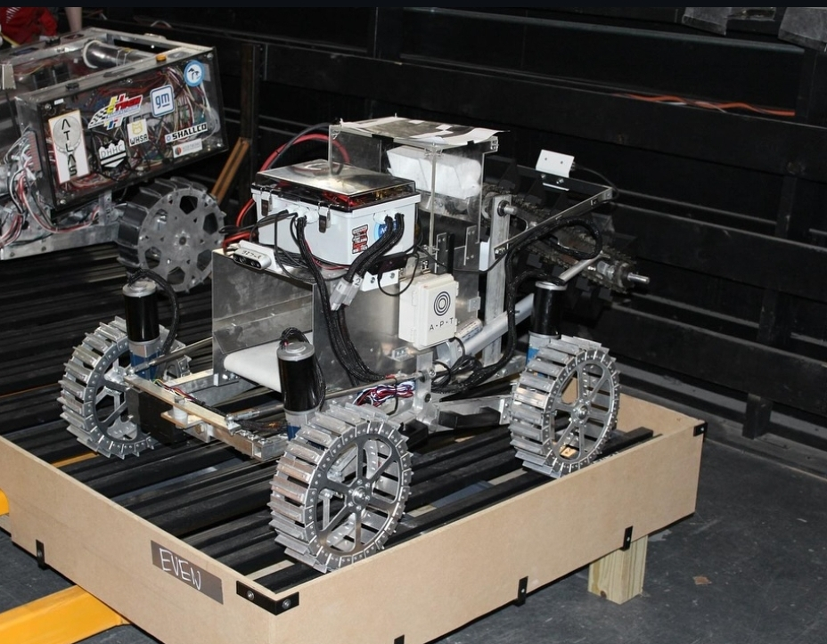

# 🚀 ASME Lunabotics 2025 University of Miami – Electrical Subsystem

Welcome to the official repository for the electrical subsystem of the University of Miami’s ASME Lunabotics team for the **2024 NASA Lunabotics Competition**.

---

## 📚 Table of Contents

- [Project Overview](#project-overview)  
- [Achievements](#achievements)  
- [The Rover](#the-rover)  
- [Electrical System Architecture](#electrical-system-architecture)  
- [CAN Bus System](#can-bus-system)  
- [Motor drivers (Sabertooth 2x12)](#motor-drivers-sabertooth-2x12)
- [Motor drivers (BTS7960)](#motor-drivers-bts7960)  
- [Acknowledgement](#acknowledgement)
- [2025 season plan ](#2025-season-plan)
---

## 📌Project Overview

This project highlights main work done by the electrical team of the University of Miami’s **ASME Lunabotics** for the **2024 NASA Lunabotics Competition** — a nationally recognized challenge that tasks university teams with designing and building autonomous lunar excavators capable of navigating and collecting regolith in a simulated lunar environment.

Without hesitation, the **2025 season marked a pivotal turning point** for the team. We built multiple subsystems entirely from scratch, including the complete **electrical subsystem**.
In the design process, we prioritized **simplicity and reliability**, focusing on minimizing points of failure while ensuring high performance in harsh simulated lunar conditions. 

---

## 🏆Achievements

- 🏅 **Leaps and Bounds Award** – For significant improvements in the application of systems engineering. 
- 🥉 **3rd Place in Presentation and Demonstration**  
- ⚡ **Most Energy-Efficient Team**


---

## 🤖The Rover
<p align="center">
  
</p>
<p align="center">
  <b>NASA Lunabotics 2025 – Fully Assembled Rover</b><br>
  <a href="assets/">📸 See More Photos</a>
</p>

---

## ⚡Electrical System Architecture
<p align="center">
  
</p>
<p align="center">
  <b> Full Simplified Circuit</b>
  </p>
  
  <p align="center">
 <br>
  <a href="assets/Circuits"> Click here to view the full detailed schematics </a>
</p>

---

## 💻 CAN Bus System


The Controller Area Network (CAN) bus is a communication protocol designed for real-time data exchange between electronic devices over a single pair of wires called CAN LOW and the other called CAN HI. Unlike traditional point-to-point serial communication, CAN uses a multi-master architecture where each node (or device) can transmit and receive messages without a central host. Messages are prioritized by IDs, enabling critical data to take precedence during high-traffic periods. CAN also includes error-checking mechanisms like CRC and automatic retransmission, ensuring communication integrity even in electrically noisy environments.  In our rover, the CAN bus linked the **Raspberry Pi** to multiple **Raspberry Pi Pico**, enabling efficient communication of data from sensors and motor encoders. We used CAN bus to reduce the computational load on the main microcontroller, allowing us to distribute this load on multiple nodes. In addition, the CAN bus allowed us to reduce the wire complexity. We used the CAN module **MCP2515** that communicates with the microcontrollers via the SPI and then sends the data through the CAN H and CAN L wires. Note: In this configration, we used the CAN classic 2.0 with data rate of 500 kbit/s.

<p align="center">
  
</p>
<p align="center">
  <b>CAN bus circuit</b><br>
  <a href="assets/Circuits"> See The complete CAN Circuits</a>
</p>
---
## 🧩 Hardware Setup

This section covers how to connect the MCP2515 and the encoder to the Raspberry Pi Pico.

### 🔌 Wiring

#### MCP2515 → Pico

| MCP2515 Pin | Pico Pin |
|-------------|-----------|
| MOSI        | GP19      |
| SCK         | GP18      |
| MISO        | GP16      |
| CS          | GP17      |
| VCC         | 3V3       |
| GND         | GND       |

#### Encoder → Pico

| Encoder Pin | Pico Pin |
|-------------|-----------|
| 3V          | 3.3V      |
| 5V          | 5V        |
| Pin3        | N.C.      |
| Pin4        | N.C.      |
| B           | GP15      |
| Pin6        | N.C.      |
| A           | GP14      |
| Pin8        | N.C.      |
| Pin9        | N.C.      |
| GND         | GND       |

## MCP2515 → Pi 4

| MCP2515 Pin | Raspberry Pi 4 Pin |
|-------------|--------------------|
| CS          | GPIO8 (CE0)        |
| MOSI        | GPIO10 (MOSI)      |
| SCK         | GPIO11 (SCLK)      |
| MISO        | GPIO21 (MISO)      |
| INT         | GPIO25             |
| VCC         | 3.3V               |
| GND         | GND                |

# 🧩 Raspberry Pi MCP2515 Setup

This guide details how to configure a Raspberry Pi to work with an MCP2515 CAN controller module by editing the system configuration file.

---

## 1. Edit the System Config File

First, open the `/boot/firmware/config.txt` file by the following command in terminal.

```bash
sudo nano /boot/firmware/config.txt
```

## 2. Add Overlay Configuration

Next, copy and paste these lines to the end of the `config.txt` file. This tells the Pi to enable the SPI interface and load the necessary driver for the MCP2515 chip.

⚠️ **Important:**

- The `oscillator` value must match the crystal on your specific MCP2515 module. Common values are `8000000` (8 MHz) and `16000000` (16 MHz). You can find this value printed on the crystal of your MCP2515 module.
- The `interrupt` value must match the GPIO pin you connected to the module's `INT` pin.

```ini
# --- MCP2515 CAN Bus Configuration ---
# 1. Enable the SPI bus
dtparam=spi=on
dtoverlay=mcp2515-can0,oscillator=8000000,interrupt=25
```


## ✅ Tips

- Use `loopback=True` first to test.
- When connecting to a real CAN bus, set `loopback=False` and `silent=False`.
- Make sure SPI pins match your Pico’s pinout.


## 📝 Full CAN bus Code with detailed instructions on how to run

👉 **[Click here](CAN%20code)**

---


# 🧩Motor drivers (Sabertooth 2x12)

The Sabertooth 2x12 is a versatile, dual-channel motor driver designed to control two DC motors with up to 12 A continuous current per channel. It supports multiple control modes, including analog, radio control (RC), and serial communication.
---
## You can not plug the Raspberry pi directly to the Sabertooth !! 


One of the challenges we faced was the voltage incompatibility between the **Raspberry Pi**, which operates at 3.3V logic, and the Sabertooth motor driver, which requires 5V logic for reliable serial communication. In the 2023 competition, the team addressed this issue by routing control signals through an **Arduino**, which acted as a 5V buffer. While this worked, it introduced unnecessary complexity and potential communication delays. To make the system simpler and reduce the points of failure, we transitioned to using compact **bi-directional logic level converters (BSS138)**, allowing us to safely and efficiently shift the 3.3V signals up to 5V. This solution maintained signal integrity and enabled direct communication between the Pi and the Sabertooth.

<p align="center">
  
</p>

<p align="center">
  <b>Sabertooth and H-bridge Motor Drivers Circuit Schematics </b><br>
</p>

### Sabertooth 2x12 Motor Driver Configuration


To reduce the wiring complexity, the serial mode was used. This explains how to set up the **Sabertooth 2x12** motor driver for **packetized serial mode** with default DIP switch settings and configurable address bits.

📄 [Official Sabertooth 2x12 Datasheet (PDF)](https://www.dimensionengineering.com/datasheets/Sabertooth2x12.pdf)


### ✅ Fixed DIP Switch Settings (#1–#3)


Always make sure the first three DIP switches are set as follows:

| Switch | Position | Purpose                   |
|:------:|:--------:|---------------------------|
| 1      | DOWN     | Serial mode enabled       |
| 2      | DOWN     | Baud rate set to 9600 bps |
| 3      | UP       | Address bit (fixed)       |


### 🔄 Configurable DIP Switches (#4–#6)

Use switches **#4–#6** to set the **serial address**.  
These switches work together with Switch #3 (which is always UP) to define the final address. The documentation above has detailed configration for these switches.

### 🔧 Sample code for testing

To test the motors, we wrote a script using the `pysabertooth` library. Each Sabertooth was initialized with a unique address. This script demonstrates safe testing under current limitations and includes logic for bidirectional control.

```python
from pysabertooth import Sabertooth

# Initialize Sabertooth motor driver on address 128
motor1 = Sabertooth("/dev/serial0", baudrate=9600, address=128)
motor1.open()
motor1.drive(1, 60)  # Drive motor 1 at 60% power
motor1.drive(2, 60)  # Drive motor 2 at 60% power
```

👉 View the full motor test script [here](Main%20codes/motor_testing.py)


---

## 🧩Motor drivers (BTS7960)

---
The BTS7960 is a high-power H-bridge motor driver module capable of driving DC motors with currents up to 43A. This motor driver support speed and direction control via PWM signals. These drivers had beem used to control the linear actuators. 
<p align="center">
  
</p>

<p align="center">
  <b> Sabertooth and H-bridge Motor Drivers Circuit Schematics </b><br>
</p>

| **Pin Name**    | **Description**                                   |
| --------------- | ------------------------------------------------- |
| **L\_EN**       | Left side enable pin (enable left half-bridge)    |
| **R\_EN**       | Right side enable pin (enable right half-bridge)  |
| **L\_PWM**      | Left side PWM input (controls direction/speed)    |
| **R\_PWM**      | Right side PWM input (controls direction/speed)   |
| **RPWM / LPWM** | Alternative labeling for direction control inputs |
| **VCC**         | 5V logic power input                              |
| **GND**         | Ground                                            |
| **Motor+**      | Motor positive terminal                           |
| **Motor-**      | Motor negative terminal                           |
| **B+**          | Battery positive (motor power input)              |
| **B-**          | Battery negative (ground)                         |

If you want to reduce the wiring complexity, you can just PULL L_EN, R_EN, and VCC to be high, and then you can easily control the speed of the actuator by the PWM from only two pins from the PI.

**[Click here to access the test script to run the actuators using H-bridge motor driver](Main%20codes/Actuator.py)**

## 🙏Acknowledgement 

This project was completed under the direct supervision, direct contribution, and mentoring of Russel Roberts, a third-year PhD student studying Physics at the University of Miami. Special thanks for the guidance, expertise, and support provided throughout the development and testing process of this project.

##  🎯2026 Season Plan 
We finalized the season plan for 2026 for the electrical subsystem with detailed performance analysis for each part we used in the electrical system and proposed improvement.

**[Click here to access the 2025 season plan](https://www.overleaf.com/read/gmnmmjygcdmp#dd8f39)**

