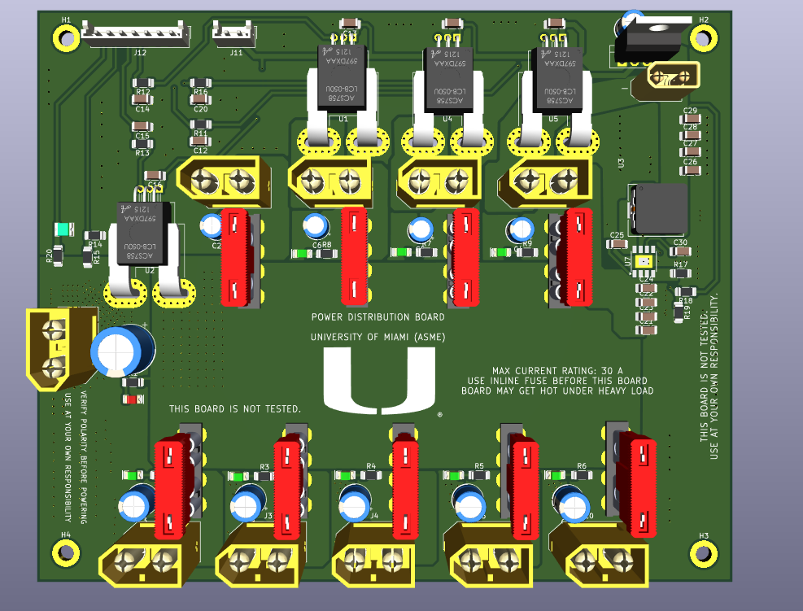

# 🚀 ASME Lunabotics 2026 University of Miami – Electrical Subsystem

Welcome to the official repository for the electrical subsystem of the University of Miami’s ASME Lunabotics team for the **2026 NASA Lunabotics Competition**.

---

This repository documents the design, implementation, and testing of the rover’s electrical system, emphasizing high reliability, efficiency, and simplicity.

# 2026 Design Goals

- Design an effective system with high reliability, minimal points of failure, and strategic redundancies while keeping it simple with minimal components and maximum efficiency.

- Focus on real-time data logging of current, voltage, power, temperature, and speed for post-analysis and future optimization.

- Reduce wiring complexity by using multiplexed communication protocols.

- Ensure reliable wired communication and power distribution to motors and other subsystems.
---
# 2026 Proposed Electrical Architecture

  
  

  <b> High Voltage Electrical Architecture </b>
  

  

  

  <b> Control Electrical Architecture </b>
  

---
## High-Current Power Distribution Board
This high-current board distributes power to all outputs, including the four drivetrain motors, the excavation motor, the deposition motor, and two linear actuators.

  

  <b> High-Current Power Distribution Board PCB </b>

For more details refer to this link: [to be added]

---
## Low-Level Control Board based on Teensy 4.1

  

  <b> Low-Level Control Board based on Teensy 4.1 PCB </b>

For more details refer to this link: [To be added]

---
##  🎯2026 Season Plan 
We finalized the season plan for 2026 for the electrical subsystem with detailed performance analysis for each part we used in the electrical system and proposed improvement.

**[Click here to access the 2025 season plan](https://www.overleaf.com/read/gmnmmjygcdmp#dd8f39)**
